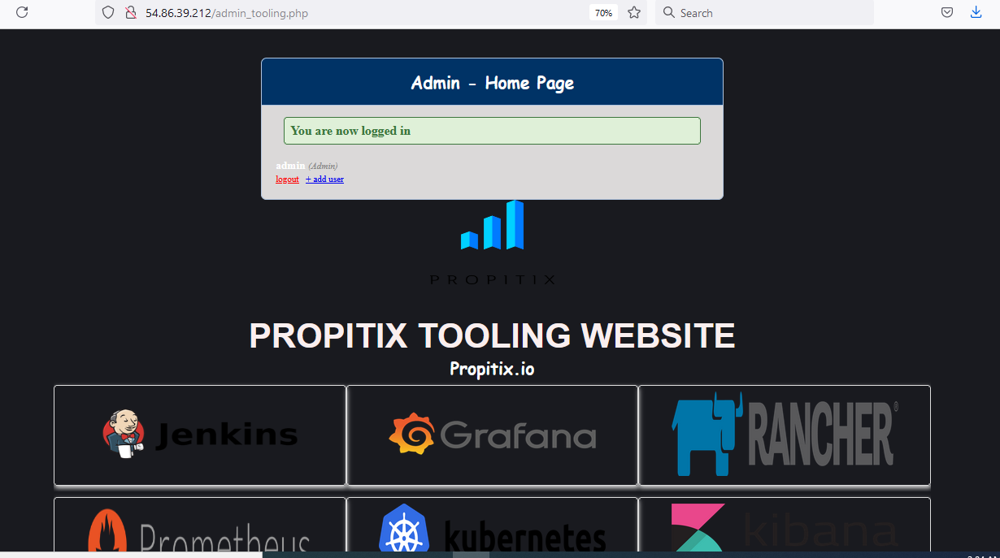

# Load Balancer Solution With Apache

This is a continuation of projecct 7. The objective is to add an Apache load balancer
to distribute traffics between web servers and allow users to access our website using a single URL.

Configure Apache as a load balancer.
* Launch an Ubuntu server 20.04 and install Apache2
* Configure it as a load balancer.
* Open port 80
* Verfiy configuration by accessing your LB public IP address or Public DNS name from your browser.

